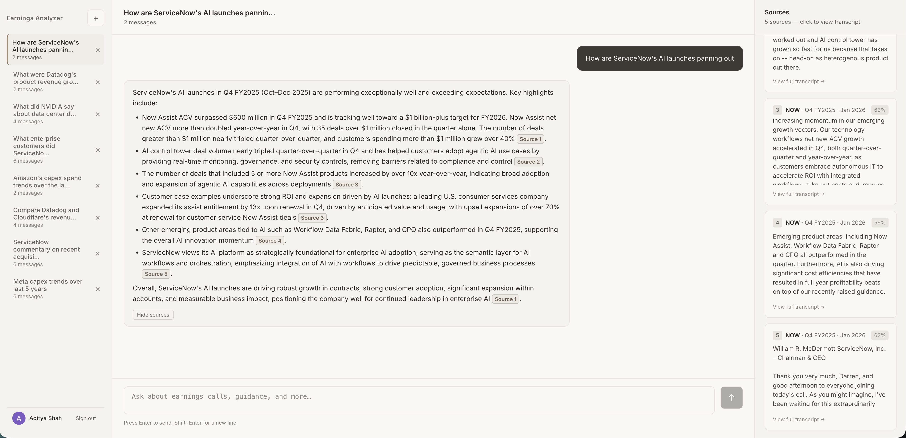
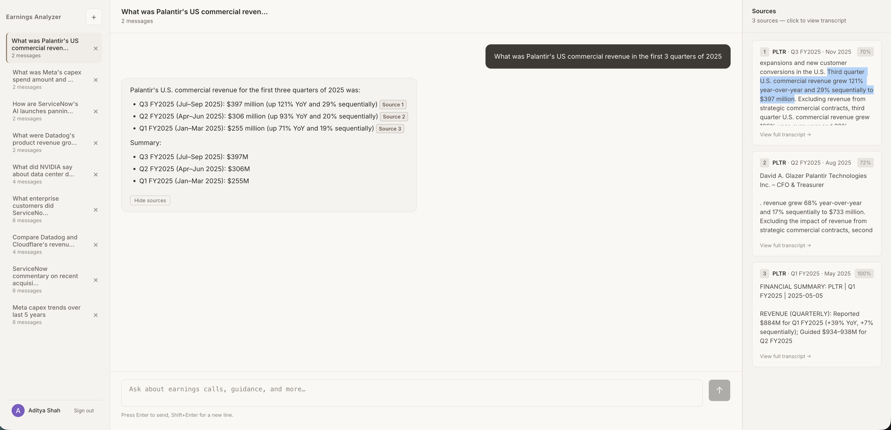

# Earnings Analyzer

A production RAG agent for querying earnings call transcripts. Ask natural-language questions across companies and quarters — it resolves entities, retrieves relevant transcript passages, and streams cited answers.

**[Live Demo →](https://earnings-analyzer-frontend-vr0j.onrender.com/)**

Covers 45 software companies including:
`ADBE` `AI` `AMZN` `APPF` `ASAN` `CFLT` `CRM` `CRWD` `CXM` `DDOG` `DOCU` `DOCN` `DT` `FRSH` `GOOGL` `GTLB` `HUBS` `IOT` `KVYO` `MDB` `META` `MNDY` `MSFT` `NET` `NOW` `NTNX` `NVDA` `OKTA` `PANW` `PATH` `PAYC` `PCOR` `PCTY` `PLTR` `RBRK` `SAIL` `SHOP` `SNOW` `TEAM` `TOST` `TTAN` `TWLO` `VEEV` `WDAY` `ZS`

> **Access is invite-only.** The live demo is rate-limited to keep API costs manageable. To request access, email [adihshah@gmail.com](mailto:adihshah@gmail.com) with your Google account address.

---

## Screenshots


*Cited answer: how AI has impacted ServiceNow's business*


*Retrieved transcript passages for the ServiceNow query*


*Temporal trend query across multiple quarters*

## What it does

- Ask questions like _"How did Apple describe their Services margin in the last two quarters?"_ or _"Compare AMD and NVIDIA's data center commentary in Q3 FY2025"_
- Resolves tickers, fiscal quarters, and natural-language dates ("last quarter", "Q3 FY2026") to exact call dates in the database
- Retrieves the most relevant transcript passages using hybrid search (vector + full-text), then generates a streaming, source-cited answer
- Maintains multi-turn conversation context within a session

## Features

- **Hybrid RAG pipeline** — pgvector cosine similarity + PostgreSQL full-text search fused via Reciprocal Rank Fusion (RRF)
- **Entity & temporal resolution** — maps natural language to exact `(ticker, call_date)` pairs via a cheap LLM call against actual call dates in the DB
- **Speaker-aware ingestion** — chunks transcripts along speaker turns with role/metadata preservation
- **Multi-turn conversation** — session-based history with in-memory buffer for immediate context
- **SSE streaming** — token-by-token response delivery with final cited source payload
- **Fiscal calendar awareness** — 49 tickers with company-specific fiscal year end mappings
- **Eval harness** — retrieval evals (precision/recall/MRR/hit rate), agent evals (faithfulness/relevance/completeness via LLM judges)
- **Google OAuth** — JWT-based auth with per-user session isolation and invite-only access control

> For deep technical documentation, see [ARCHITECTURE.md](ARCHITECTURE.md).

---

## Architecture

```
earnings_analyzer/
├── backend/
│   ├── app/
│   │   ├── main.py
│   │   ├── config.py
│   │   ├── agents/           # RAG pipeline, entity resolution, streaming
│   │   ├── rag/              # Retriever, ingestion, embeddings, fiscal calendar
│   │   ├── evals/            # Eval runner, retrieval evals, LLM judges
│   │   ├── auth/             # Google OAuth, JWT, invite allowlist
│   │   ├── conversations/    # Session history service
│   │   ├── models/           # SQLAlchemy models + Pydantic schemas
│   │   └── prompts/          # System prompt templates
│   ├── scripts/
│   │   ├── batch_ingest_transcripts.py   # Bulk ingest .docx transcripts
│   │   ├── seed_transcript.py            # Seed JSON eval data
│   │   ├── run_evals.py                  # Agent eval runner
│   │   ├── run_retrieval_evals.py        # Retrieval eval runner
│   │   └── reextract_financials.py       # Re-extract financial summaries
│   ├── transcripts/          # .docx transcripts: {TICKER}/{YYYY-MM-DD}.docx
│   ├── tests/
│   ├── alembic/
│   └── .env.example
├── frontend/                 # React + Vite (TypeScript)
└── README.md
```

## Request Flow

```
User query (React)
  → POST /agent/query (SSE stream)
  → stream_simple_rag_or_agent()
      1. _resolve_entities_via_llm()     — gpt-4.1-mini extracts (ticker, date) pairs
                                           from query + recent session context
      2. retrieve_relevant_chunks()      — hybrid RRF search, per-pair chunk selection,
                                           financial summary injection
      3. OpenAI LLM call (streaming)    — generates answer with [Source N] citations
  → SSE "delta" events (tokens) + "done" event (full AgentResponse with sources)
  → Session saved to DB asynchronously
```

---

## Self-Hosting

### Prerequisites
- Python 3.11+
- Node.js 18+
- OpenAI API key
- PostgreSQL with pgvector (Supabase, Render Postgres, or self-hosted)
- Google OAuth credentials (for auth; see [Google Cloud Console](https://console.cloud.google.com/))

### Backend

```bash
python -m venv .venv && source .venv/bin/activate
pip install -r backend/requirements.txt

cp backend/.env.example backend/.env
# Fill in: OPENAI_API_KEY, DATABASE_URL, GOOGLE_CLIENT_ID, GOOGLE_CLIENT_SECRET, JWT_SECRET, ADMIN_API_KEY

cd backend && alembic upgrade head
cd backend && uvicorn app.main:app --reload --port 8000
```

### Frontend

```bash
cd frontend && npm install

# Create frontend/.env.local
echo "VITE_API_URL=http://localhost:8000" > frontend/.env.local

npm run dev   # http://localhost:5173
```

### Ingest transcripts

Place `.docx` transcript files under `backend/transcripts/{TICKER}/{YYYY-MM-DD}.docx`, then:

```bash
cd backend && python scripts/batch_ingest_transcripts.py
```

### Access control

By default, the first user to sign in will be approved (any users already in the DB when you run migrations are grandfathered). To approve a new user:

```bash
# User must have signed in at least once (creates their DB row)
curl -X POST https://your-backend.com/auth/set-approval \
  -H "X-Admin-Key: YOUR_ADMIN_API_KEY" \
  -H "Content-Type: application/json" \
  -d '{"email": "someone@gmail.com", "approved": true}'

# Pre-approve before they sign in (creates a stub record)
curl -X POST https://your-backend.com/auth/set-approval \
  -H "X-Admin-Key: YOUR_ADMIN_API_KEY" \
  -H "Content-Type: application/json" \
  -d '{"email": "someone@gmail.com", "approved": true}'

# Revoke access
curl -X POST https://your-backend.com/auth/set-approval \
  -H "X-Admin-Key: YOUR_ADMIN_API_KEY" \
  -H "Content-Type: application/json" \
  -d '{"email": "someone@gmail.com", "approved": false}'
```

### Docker

```bash
cd backend
docker build -t earnings-analyzer-backend .
docker run -p 8000:8000 \
  -e DATABASE_URL=postgresql+asyncpg://... \
  -e OPENAI_API_KEY=sk-... \
  -e ADMIN_API_KEY=your-secret \
  -e CORS_ORIGINS='["https://your-frontend.com"]' \
  earnings-analyzer-backend
```

Alembic migrations run automatically on container startup. See [backend/DEPLOY.md](backend/DEPLOY.md) for full deployment notes.

---

## API Reference

| Method | Path | Description |
|--------|------|-------------|
| POST | `/agent/query` | Query the RAG agent — SSE stream of delta tokens + final `AgentResponse` |
| GET | `/warmup` | Pre-warm in-process caches (companies, embeddings) |
| GET | `/health` | Database health check |
| **Auth** | | |
| GET | `/auth/google` | Redirect to Google OAuth consent screen |
| GET | `/auth/google/callback` | OAuth callback — exchanges code, issues JWT |
| GET | `/auth/me` | Return current user (requires `Authorization: Bearer <jwt>`) |
| POST | `/auth/set-approval` | Approve or revoke a user by email (requires `X-Admin-Key`) |
| **Conversations** | | |
| GET | `/conversations/sessions` | List sessions for authenticated user |
| GET | `/conversations/{session_id}/history` | Get conversation history with sources |
| DELETE | `/conversations/{session_id}` | Delete a session |
| **RAG** (admin) | | |
| POST | `/rag/ingest/manual/upload` | Upload `.docx` transcript |
| POST | `/rag/search` | Direct hybrid/vector/keyword search |
| **Evals** (admin) | | |
| POST | `/evals/run` | Run agent eval suite |
| POST | `/evals/retrieval` | Run retrieval evals (precision/recall/MRR) |

> Admin-protected routes require `X-Admin-Key: <ADMIN_API_KEY>`. Set `ADMIN_API_KEY=""` in `.env` to disable protection in dev.

---

## Tech Stack

| Layer | Technology |
|-------|-----------|
| Framework | FastAPI + Pydantic |
| LLM | OpenAI gpt-4.1-mini |
| Embeddings | OpenAI text-embedding-3-small (1536 dims) |
| Vector search | PostgreSQL + pgvector (ivfflat) |
| Full-text search | PostgreSQL TSVector + `websearch_to_tsquery` |
| Ranking | Reciprocal Rank Fusion (RRF, K=60) |
| Auth | Google OAuth 2.0 + HS256 JWT |
| ORM | SQLAlchemy (async) + asyncpg |
| Migrations | Alembic |
| Frontend | React + Vite (TypeScript) |
| Deployment | Render (backend + frontend) |
